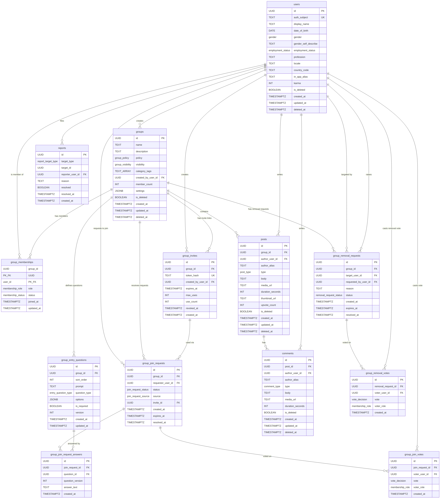

# GirlTea

An anonymous community app where people can vent, support each other, and spill tea
about life — in trusted, closed groups with real approval flows.

## Data Model

The PostgreSQL schema lives in `schema/` and is split into numbered migration files:

| File | Contents |
|---|---|
| `001_enums.sql` | All enum types (gender, group policy, visibility, roles, etc.) |
| `002_users.sql` | User profiles (name, DOB, gender, employment, soft-delete) |
| `003_groups.sql` | Groups with policy, visibility, JSON settings, member count |
| `004_group_memberships.sql` | Membership join table (role, status) |
| `005_group_invites.sql` | Invite link tokens for LINK_ONLY groups |
| `006_group_entry_questions.sql` | Per-group questionnaire with versioning |
| `007_group_join_requests.sql` | Join requests with status, source, expiry |
| `008_group_join_request_answers.sql` | Answers to entry questions per request |
| `009_group_join_votes.sql` | Approval / rejection votes with role snapshot |
| `010_posts.sql` | Posts (text, video, voice) with 3-min media cap |
| `011_comments.sql` | Text + voice comments (3-min cap) on posts |
| `012_reports.sql` | Moderation reports |
| `013_indexes.sql` | All indexes (partial, GIN, composite) |
| `014_triggers.sql` | Triggers for member count, updated_at, request expiry |
| `015_approval_logic.sql` | Transactional vote + admit function, eligibility check |
| `016_group_removal_requests.sql` | Democratic member removal requests |
| `017_group_removal_votes.sql` | Votes on removal requests |
| `018_removal_logic.sql` | Transactional removal vote + ban function |

See `schema/DESIGN.md` for the full rationale behind each design decision, the
suggestion assessment, and the approval/visibility/policy matrices.

### Schema Diagram

The diagram shows all 13 tables, every column with its type, and all foreign key
relationships. Also available as [SVG](schema/schema-diagram.svg) and editable
[Mermaid source](schema/schema-diagram.mmd).

## Key Concepts

- **Group policies**: `WOMEN_ONLY`, `MIXED`, `GENDER_NEUTRAL` — controls who can request to join
- **Group visibility**: `LINK_ONLY` (invite link required), `DISCOVERABLE` (appears in suggestions)
- **Democratic authority**: No single person has unilateral power; all high-impact actions (admission, removal) require at least 2 members to agree, especially in groups under 10 members
- **Approval flow**: Configurable quorum (default 2 approvers); switches to admin-only above a configurable group size
- **Removal flow**: Any member can raise a removal request; their intent counts as vote #1, one more member must approve
- **Content types**: Posts support text, video, and voice (each as a standalone post); comments support text and voice — all media capped at 3 minutes via DB constraints
- **Entry questions**: Groups can define questionnaires; answers are shown to voters
- **Soft deletes**: Users, groups, posts, and comments support reversible deletion
