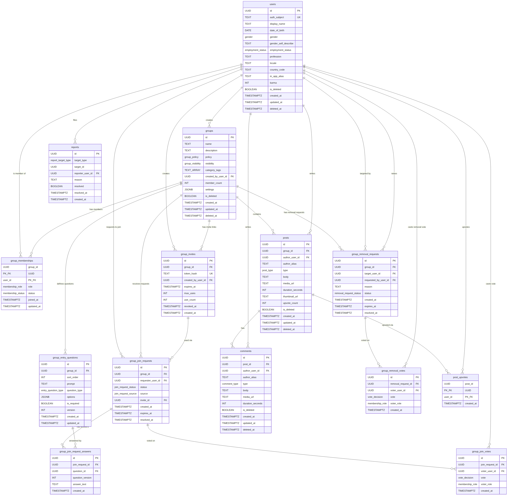

# GirlTea

**Private little rooms that make it easy to actually talk to your people again.**

Close friendships go quiet as adult life gets busier. You still love these people,
but the conversation shrinks to "happy birthday ❤️", "omg congrats!", and "let's
meet soon" — the friends who once knew everything about your life slowly know only
the headlines. GirlTea is a small set of **invite-only circles** where you
reconnect with your actual people, mostly through short **video and voice** rather
than typing.

The product rests on a few principles:

- **Circles are the social structure** — invite-only rooms for a specific set of
  people who share the context (school friends, gym girls, work friends). You talk
  about parents with the friends who know the history; work with the friends who
  understand that world.
- **Video/voice is the mechanism** — you *tell* your girls something, you don't
  just post text into a feed.
- **Ephemerality removes permanence** — tea gets cold; conversations are meant to
  be temporary (see the roadmap — 30-day expiry is planned, not yet shipped).
- **Themes create ownership** — each circle feels like its own room.
- **Memories preserve what matters** — the tension of the whole product:
  *conversations are temporary, memories are intentional.*

The core loop we're optimizing for: **something happens → "I need to tell my
girls" → open GirlTea → Spill → they respond → I feel closer to them.** Everything
in [`ROADMAP.md`](ROADMAP.md) is ranked by how much it improves those 90 seconds.

> **Not a community app.** GirlTea is *not* Reddit-for-women or a place to meet
> like-minded strangers. It's for maintaining close relationships with people you
> already know. Discoverable/public groups exist in the schema but are being pulled
> out of the V1 product surface — see `ROADMAP.md`.

## What's Built Today

- Auth (phone/email OTP), profiles, and **invite-only circles** (school friends,
  gym girls, work friends, …)
- Members post **text, images, videos, or voice** (video/voice capped at 3 min) and
  comment (text, image, voice)
- A full governance backend — entry questions, **2-member approval** to join,
  democratic removal, moderation, and right-to-erasure. *Much of this is heavier
  than a 3-person circle needs; the roadmap trims it for V1.*
- Design system with 8 themes and per-theme wallpaper art (Flutter web, on Render)
- Additive schema for circle identity, Memories (`saved_posts`), and rich reactions
  — landed in the DB, UI surfacing in progress
- Everything backed by PostgreSQL + Supabase (auth, storage, RLS)

See [`ROADMAP.md`](ROADMAP.md) for what's next and why, and **What's Not Built
Yet** below for the honest gaps (push notifications, native mobile, 30-day expiry).

## The Web App & Design System

The client is a Flutter web app (single file `app/lib/main.dart`) deployed to
**[girltea.onrender.com](https://girltea.onrender.com)** — Render builds the
container from `app/Dockerfile` and auto-deploys on every push to `main`.

The look is driven by a small design system in `app/lib/design/`, not ad-hoc
styling:

- **Tokens** (`tokens.dart`) — semantic color roles (`surface`, `onSurface`,
  `accent`, `hairline`, …) exposed via a `GtColors` theme extension, plus
  spacing, radii, soft shadows, and motion tokens. Reading colors by role (not
  raw hex) is what makes light/dark a token swap rather than a rewrite.
- **Type** (`type.dart`) — Playfair Display for editorial/emotional headings,
  Inter for UI/body.
- **8 named themes** — Cotton Candy, Queer Joy, Indigo Nights, Sage Space,
  Sunset Drive, Lavender Haze, Cherry Kiss (default), Noir Club. Chosen from the
  top-bar menu; `ThemeController` persists the pick to `localStorage`.
- **Per-theme background art** — three themes (Cotton Candy, Queer Joy, Indigo
  Nights) carry aesthetic wallpapers (`app/assets/themes/`). A `ThemedBackdrop`
  paints a faded, scrimmed wallpaper behind six screens (login, onboarding, the
  two empty states, the circle-list home, and active feeds); the other themes
  render plain. Art is optional per theme (`GtThemeArt`).

## Project Structure

```
girltea/
├── README.md                          ← You are here
├── schema/                            ← PostgreSQL data model (29 SQL files)
│   ├── 001_enums.sql                  ← All enum types
│   ├── 002_users.sql                  ← User profiles
│   ├── 003_groups.sql                 ← Groups with policy/visibility/settings
│   ├── 004_group_memberships.sql      ← Who belongs to which group
│   ├── 005_group_invites.sql          ← Invite link tokens
│   ├── 006_group_entry_questions.sql  ← Per-group questionnaires
│   ├── 007_group_join_requests.sql    ← Join requests
│   ├── 008_group_join_request_answers.sql ← Answers to entry questions
│   ├── 009_group_join_votes.sql       ← Approval/rejection votes
│   ├── 010_posts.sql                  ← Posts (text/image/video/voice)
│   ├── 011_comments.sql               ← Comments (text/image/voice)
│   ├── 012_reports.sql                ← Moderation reports
│   ├── 013_indexes.sql                ← All indexes
│   ├── 014_triggers.sql               ← Triggers (member count, timestamps, expiry)
│   ├── 015_approval_logic.sql         ← Transactional join approval function
│   ├── 016_group_removal_requests.sql ← Democratic removal requests
│   ├── 017_group_removal_votes.sql    ← Removal votes
│   ├── 018_removal_logic.sql          ← Transactional removal function
│   ├── 019_post_upvotes.sql           ← Upvote tracking
│   ├── 020_alias_generator.sql        ← fn_generate_alias() for per-group aliases
│   ├── 021_hub_rpcs.sql               ← Hub RPCs (create group, resolve invite, join, pending votes)
│   ├── 022_moderation.sql             ← Moderation queue + actions
│   ├── 023_erasure.sql                ← Right-to-erasure purge path (DPDP/GDPR)
│   ├── 024_group_slugs.sql            ← Readable group slugs for URLs (/college-girls)
│   ├── 025_circle_identity.sql        ← groups.emoji/accent_color/cover_image_url + extended create RPC
│   ├── 026_saved_posts.sql            ← "Memories" — save a post to a personal keepsake archive
│   ├── 027_post_reactions.sql         ← Rich reactions (LOVE/HUG/CRY/LAUGH/TEA/SPARK) over the binary upvote
│   ├── 028_invite_inviter_name.sql    ← fn_resolve_invite returns the inviter's display name
│   ├── 029_create_invite.sql          ← fn_create_invite: any active member mints a shareable link
│   ├── DESIGN.md                      ← Design decisions, flow diagrams, matrices
│   ├── schema-diagram.png             ← ER diagram (high-res)
│   ├── schema-diagram.svg             ← ER diagram (scalable)
│   └── schema-diagram.mmd            ← ER diagram (editable Mermaid source)
├── supabase/                          ← Supabase configuration
│   ├── config.toml                    ← Supabase CLI config for local dev stack
│   ├── auth_setup.sql                 ← Links app users to Supabase Auth
│   ├── auth_helpers.sql               ← Auth helper functions used by RLS/RPCs
│   ├── rls_policies.sql               ← Row Level Security for all 14 tables
│   ├── storage_buckets.sql            ← Storage bucket definitions
│   ├── storage_policies.sql           ← Storage access policies
│   ├── AUTH.md                        ← Auth setup guide + Flutter examples
│   ├── STORAGE.md                     ← Storage architecture + setup guide
│   └── QUERIES.md                     ← Complete query reference for Flutter app
├── app/                               ← Flutter web client (see app/README.md)
│   ├── lib/main.dart                  ← The app (single-file): auth, feeds, composer, moderation
│   ├── lib/design/tokens.dart         ← Design system: color/spacing/radii/shadow tokens, 8 themes, wallpaper art
│   ├── lib/design/type.dart           ← Type scale (Playfair Display + Inter)
│   ├── assets/themes/                 ← Per-theme background art (Cotton Candy / Queer Joy / Indigo Nights)
│   └── Dockerfile                     ← Container build served on Render
├── render.yaml                        ← Render deploy config (auto-deploys from main)
└── scripts/
    ├── dev-code.sh                    ← Prints an instant sign-in code for the LOCAL Supabase stack
    └── cloud-code.sh                  ← Same, but against the live Cloud project (needs service_role)
```

## Schema Diagram



14 tables, every column with its type, and all foreign key relationships. Also
available as [SVG](schema/schema-diagram.svg) and editable
[Mermaid source](schema/schema-diagram.mmd).

> The schema diagram above predates migrations `025`–`029`; the tables/columns
> those add (below) aren't drawn in it yet.

## Data Model (16 tables)

### Users & Identity

| Table | Purpose |
|---|---|
| `users` | Profile: display name, date of birth, gender (9 options + self-describe + prefer not to say), employment status, profession. Soft-delete for GDPR/DPDP. Minimum age 13 enforced. `users.id` = Supabase `auth.users.id`. |

### Groups & Membership

| Table | Purpose |
|---|---|
| `groups` | Name, description, policy (`WOMEN_ONLY` / `MIXED` / `GENDER_NEUTRAL`), visibility (`LINK_ONLY` / `DISCOVERABLE`), category tags, configurable approval settings (JSON). Member count maintained via trigger. **Circle identity (`025`):** optional `emoji`, `accent_color`, `cover_image_url` so each circle feels like its own room. |
| `group_memberships` | Links users to groups. Role: `OWNER` / `ADMIN` / `MEMBER`. Status: `ACTIVE` / `BANNED` / `LEFT`. Composite PK `(group_id, user_id)`. |
| `group_invites` | Token-based invite links for sharing via WhatsApp etc. Supports expiry, max uses, revocation. |

### Join Flow (request → entry questions → vote → admit)

| Table | Purpose |
|---|---|
| `group_entry_questions` | Per-group questionnaire (short text, long text, single/multi choice). Versioned so edits don't orphan old answers. |
| `group_join_requests` | One pending request per user per group (partial unique index). Tracks source (`INVITE_LINK` / `SUGGESTION` / `MANUAL_SEARCH`). Auto-expires after 14 days. |
| `group_join_request_answers` | Answers to entry questions, linked to question version. Shown to voters. |
| `group_join_votes` | Approval/rejection with voter's role snapshot. One vote per person per request. |

### Democratic Removal Flow (raise → vote → ban)

| Table | Purpose |
|---|---|
| `group_removal_requests` | Any member raises a request against another member with a reason. One pending removal per target per group. Expires after 7 days. |
| `group_removal_votes` | Requester's APPROVE vote auto-recorded; one more member must agree for quorum of 2. |

### Content

| Table | Purpose |
|---|---|
| `posts` | Types: `TEXT`, `IMAGE`, `VIDEO`, `VOICE`. Each media post is standalone. Video/voice max 180 seconds (DB constraint). Soft-delete. |
| `comments` | Types: `TEXT`, `IMAGE`, `VOICE`. Single-level (no reply threads). Same 3-min voice cap. |
| `post_upvotes` | Composite PK `(post_id, user_id)` prevents double-taps. Trigger maintains `posts.upvote_count`. Kept intact as the legacy binary signal. |
| `post_reactions` (`027`) | Rich reactions — `LOVE` / `HUG` / `CRY` / `LAUGH` / `TEA` / `SPARK` — layered on top of upvotes (not a replacement). A `post_reactions_feed` view exposes reactions joined to the reactor's per-group **alias**, so the UI can say "Rhea & Ananya sent love" without leaking real identity. |
| `saved_posts` (`026`) | "Memories" — a personal keepsake archive. Composite PK `(user_id, post_id)`, owner-only RLS. A `saved_posts_feed` view powers the Memories screen. |
| `reports` | Moderation reports against any entity (post, comment, user, group). |

## Key Design Decisions

### Group Policies (who can join)

| Policy | Gender required at join? | Rule |
|---|---|---|
| `WOMEN_ONLY` | Yes, must be `WOMAN` | Gate at request time |
| `MIXED` | Yes, any value (including `PREFER_NOT_TO_SAY`) | User acknowledges multi-gender space |
| `GENDER_NEUTRAL` | No | Gender not part of the membership contract |

### Group Visibility (how users find groups)

| Visibility | In suggestions? | How user finds it |
|---|---|---|
| `LINK_ONLY` | No | Invite link only (WhatsApp, SMS, etc.) |
| `DISCOVERABLE` | Yes | Browse/search, filtered by tags and country |

### Democratic Authority (no single-person power)

For groups under `democraticThreshold` (default 10 members):
- **Admission**: Always requires 2+ members to approve — no owner/admin override
- **Removal**: Requester + 1 other member must agree — no one can solo-remove

For larger groups, configurable via `groups.settings` JSON:

```json
{
  "approvalMode": "HYBRID",
  "memberApproverQuorum": 2,
  "memberApprovalMaxGroupSize": 20,
  "largeGroupApprovalMode": "ADMINS_ONLY",
  "joinRequestTtlHours": 336,
  "allowInviteLink": true,
  "removalQuorum": 2,
  "removalRequestTtlHours": 168,
  "democraticThreshold": 10
}
```

### Content Rules

| Post/comment type | Required fields | Max duration | Max file size |
|---|---|---|---|
| `TEXT` | `body` | — | — |
| `IMAGE` | `media_url` | — | 10 MB |
| `VIDEO` (posts only) | `media_url`, `duration_seconds` | 180s (3 min) | 100 MB |
| `VOICE` | `media_url`, `duration_seconds` | 180s (3 min) | 10 MB |

## Authentication

Phone/email OTP via **Supabase Auth** — no passwords, no social login.

```
Enter phone/email → receive 6-digit OTP → verify
  → No profile? → Onboarding screen (name, DOB, gender, employment)
  → Has profile? → Circles overview (/home)
```

The web client uses real, shareable URLs (via `go_router`): `/home` (your
circles), `/:group-slug` (a circle's feed), and `/:group-slug/:postId` (a single
post + its tea). Group slugs are readable and derived from the group name by
`024_group_slugs.sql`.

- `users.id` = `auth.users.id` (same UUID, linked via FK)
- Profile created at onboarding, not automatically on signup (keeps NOT NULL
  constraints intact)
- Session tokens managed by Supabase SDK (auto-refresh)

| File | Purpose |
|---|---|
| `supabase/auth_setup.sql` | FK to `auth.users`, helper functions `fn_has_profile()`, `fn_my_profile()` |
| `supabase/auth_helpers.sql` | Additional auth helper functions used by RLS policies and RPCs |
| `supabase/rls_policies.sql` | Row Level Security policies for all 14 tables |
| `supabase/AUTH.md` | Full setup guide: enable OTP, Flutter code examples, SMS costs |

## Row Level Security (RLS)

Every table has RLS enabled. Users can only access data they're authorized for:

| What | Who can see it | Who can write |
|---|---|---|
| Your profile | You only | You only |
| Discoverable groups | All authenticated users | Creator |
| Private (LINK_ONLY) groups | Members only | Creator |
| Posts, comments, upvotes | Group members only | Group members (own content) |
| Join requests + answers | Requester + group members | Requester |
| Join/removal votes | Group members | Group members |
| Reports | Your own reports | Any authenticated user |

## Supabase Storage

Media files stored in **Supabase Storage** (free: 1 GB storage, 2 GB bandwidth/month,
no credit card). Database stores only URL references (`media_url`, `thumbnail_url`).

| Bucket | Contents | Max file size |
|---|---|---|
| `post-media` | Images, videos, voice for posts | 100 MB |
| `post-thumbnails` | Video thumbnail previews | 2 MB |
| `comment-media` | Images, voice for comments | 10 MB |

| File | Purpose |
|---|---|
| `supabase/storage_buckets.sql` | Bucket definitions (run once in SQL Editor) |
| `supabase/storage_policies.sql` | RLS policies for storage access |
| `supabase/STORAGE.md` | Full architecture: upload flow, setup instructions, cost notes |

## Triggers & Functions

| Function | What it does |
|---|---|
| `fn_update_group_member_count()` | Trigger: atomically maintains `groups.member_count` |
| `fn_update_post_upvote_count()` | Trigger: atomically maintains `posts.upvote_count` |
| `fn_set_updated_at()` | Trigger: auto-sets `updated_at` on row changes |
| `fn_expire_stale_requests()` | Scheduled: expires old join + removal requests |
| `fn_cast_join_vote()` | Transaction: vote → check quorum → maybe admit (atomic) |
| `fn_validate_join_eligibility()` | Checks gender policy before allowing a join request |
| `fn_cast_removal_vote()` | Transaction: vote → check quorum → maybe ban (atomic) |
| `fn_raise_removal_request()` | Creates request + auto-records requester's APPROVE vote |
| `fn_has_profile()` | Returns whether the current auth user has completed onboarding |
| `fn_my_profile()` | Returns the current auth user's profile row |
| `fn_create_group_with_owner()` | Creates a circle + its owner membership atomically. Extended in `025` with optional `emoji` / `accent_color` (old callers still work via defaults) |
| `fn_create_invite()` (`029`) | Any ACTIVE member mints a shareable invite link; token generated server-side, only its hash stored. Grants no membership — the link still runs the 2-approval join flow |
| `fn_resolve_invite()` | Resolves an invite token for the landing screen. Extended in `028` to return the inviter's `display_name` ("Niharika saved you a seat") |

## Getting Started (for new team members)

### 1. Clone the repo

```bash
git clone https://github.com/niharika06oct/girltea.git
cd girltea
```

### 2. Create a Supabase project

1. Go to [supabase.com](https://supabase.com) → sign up (free, no credit card)
2. Create new project: name `girltea`, region closest to India
3. Save the database password

### 3. Run the schema

Apply the SQL in **dependency order, not strict numeric order** — `013_indexes.sql`
and `014_triggers.sql` reference tables created in later-numbered files (`016`, `017`,
`019`), so running them in plain 001→021 order fails. Run all table/enum DDL first,
then indexes/triggers/functions:

1. Tables & enums: `001_enums` → `012_reports`, then `016_group_removal_requests`,
   `017_group_removal_votes`, `019_post_upvotes`
2. Indexes & triggers: `013_indexes`, `014_triggers`
3. Functions & RPCs: `020_alias_generator`, `015_approval_logic`, `018_removal_logic`,
   `021_hub_rpcs`, `022_moderation`, `023_erasure`, `024_group_slugs`
4. Additive features (safe to apply last, in order): `025_circle_identity`,
   `026_saved_posts`, `027_post_reactions`, `028_invite_inviter_name`,
   `029_create_invite`. All additive — existing reads keep working.

If you have the Supabase CLI and `psql` locally, the loop in `AGENTS.md` applies
everything in the correct order in one step.

### 4. Set up auth

1. Run `supabase/auth_setup.sql`, then `supabase/auth_helpers.sql` in the SQL Editor
2. Enable Phone and/or Email OTP in **Authentication** → **Providers**
3. See `supabase/AUTH.md` for detailed steps

### 5. Set up storage

1. Run `supabase/storage_buckets.sql` in the SQL Editor
2. Run `supabase/storage_policies.sql` in the SQL Editor
3. See `supabase/STORAGE.md` for detailed steps

### 6. Apply RLS policies

1. Run `supabase/rls_policies.sql` in the SQL Editor

### 7. Get your credentials

In **Settings** → **API**, copy:
- **Project URL**: `https://xxxxx.supabase.co`
- **Anon public key**: `eyJhb...`

These go into the Flutter app's Supabase initialization.

### 8. Run the Flutter app

The app reads `SUPABASE_URL` / `SUPABASE_ANON_KEY` from `--dart-define`. Without
them it defaults to the local Supabase stack (`localhost:54321`).

```bash
cd app
flutter pub get
# Against your live Cloud project (use the publishable/anon key, never service_role):
flutter run -d chrome \
  --dart-define=SUPABASE_URL=https://<your-ref>.supabase.co \
  --dart-define=SUPABASE_ANON_KEY=<your-anon-or-publishable-key>
```

For a passwordless dev sign-in code: `./scripts/dev-code.sh <email>` (local
stack) or `./scripts/cloud-code.sh <email>` (live Cloud — needs the
`service_role` key in your environment).

Production deploys automatically: pushing to `main` triggers a Render build from
`app/Dockerfile` (config in `render.yaml`).

## What's Not Built Yet

The near-term plan and *why* each item is ranked where it is lives in
[`ROADMAP.md`](ROADMAP.md). Summary of the gaps:

| Area | Status |
|---|---|
| Flutter app — auth, group feed, posts (text/image/video/voice), comments, upvotes | Built |
| Flutter app — onboarding, circle creation, invite links, join/approval, removal, moderation | Built |
| Design system + 8 themes + per-theme wallpaper art | Built |
| Circle identity (emoji/accent), Memories (saved posts), rich reactions — schema | Migrations `025`–`029` exist in-repo; verify they're applied to your Cloud project |
| Circle identity / Memories / reactions — wired into the app UI | In progress (schema-first; UI surfacing ongoing) |
| **Native iOS/Android app** | Not built — web-only today. **P0**: the product belongs on phones (`ROADMAP.md`). |
| **Push notifications** (and the mockup's bell) | Not built — no backend, intentionally not faked. **P0**, and tied to native (web push is unreliable on iOS). |
| **Bulletproof recording/upload/recovery** (compression, progress, retry, draft recovery) | Not built. **P0** — the hero behaviour; never lose a recording. |
| Join flow for tiny circles | **Bug**: 2-member quorum can't admit member #2 in a 1-member circle. P0 fix → invited members join immediately (`ROADMAP.md`). |
| 30-day auto-delete ("tea gets cold") | Not built — no `expires_at`, no cron; the UI makes no deletion promise. **Moved to P1** as core differentiation. |
| Upvote UI removal · discoverable groups pulled from V1 · minimal onboarding | Planned P1 product cleanup (`ROADMAP.md`); schema stays, product surface shrinks. |
| Login email delivery (Resend SMTP + OTP template) | Separate in-progress dashboard task |
| Cloud Function for video duration validation (FFprobe) | Deferred to post-MVP |
| Image thumbnail generation · EXIF stripping | Deferred to post-MVP |
| E2EE, biometric lock, screenshot controls | Later / P1–Later — see `ROADMAP.md` (E2EE is an architecture fork, not a bolt-on). |

## Documentation Index

| Document | What's in it |
|---|---|
| This README | Project overview, schema summary, setup instructions |
| `schema/DESIGN.md` | Full design rationale, suggestion assessment, approval/removal/visibility matrices, content model |
| `supabase/AUTH.md` | Auth setup guide, OTP config, Flutter code examples, SMS costs |
| `supabase/STORAGE.md` | Storage architecture, upload flow, bucket structure, MIME types, cost optimization |
